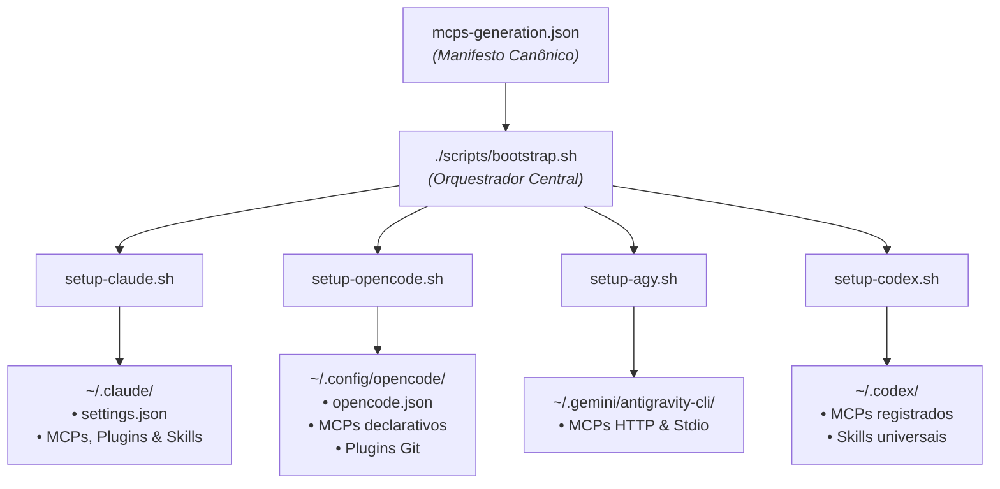

<!-- markdownlint-disable MD033 -->
<div align="center">

```text
  ██████╗ ██████╗  ██████╗     ███████╗████████╗ █████╗ ████████╗██╗ ██████╗ ███╗   ██╗
 ██╔═══██╗██╔══██╗██╔═══██╗    ██╔════╝╚══██╔══╝██╔══██╗╚══██╔══╝██║██╔═══██╗████╗  ██║
 ██║   ██║██████╔╝██║   ██║    ███████╗   ██║   ███████║   ██║   ██║██║   ██║██╔██╗ ██║
 ██║   ██║██╔══██╗██║▄▄ ██║    ╚════██║   ██║   ██╔══██║   ██║   ██║██║   ██║██║╚██╗██║
 ╚██████╔╝██║  ██║╚██████╔╝    ███████║   ██║   ██║  ██║   ██║   ██║╚██████╔╝██║ ╚████║
  ╚═════╝ ╚═╝  ╚═╝ ╚══▀▀═╝     ╚══════╝   ╚═╝   ╚═╝  ╚═╝   ╚═╝   ╚═╝ ╚═════╝ ╚═╝  ╚═══╝
```

### ⚡ Estação de Trabalho e Orquestrador de Ferramentas de IA (V0)
**Configurações unificadas, reprodutíveis e versionadas de MCPs, Plugins e Skills para Engenheiros de IA**

---

[](https://github.com/DevJoaoLopes/workstation-devjoaolopes)
[](LICENSE)
[](https://github.com/DevJoaoLopes/workstation-devjoaolopes/actions)
[]()
[]()
[](CONTRIBUTING.md)

[Visão Geral](#-visão-geral) •
[Funcionalidades](#-funcionalidades) •
[Arquitetura](#-arquitetura) •
[Quickstart](#-quickstart-numa-máquina-nova) •
[Inventário de MCPs](#-inventário-de-ferramentas) •
[Diagnóstico](#-diagnóstico-do-ambiente) •
[Docs](#-documentação-completa)

---

</div>

## 📖 Visão Geral

Cada ferramenta e CLI de IA moderna guarda suas configurações espalhadas em locais diferentes do `$HOME` (`~/.claude`, `~/.config/opencode`, `~/.gemini`, `~/.codex`), usando sintaxes distintas e marketplaces proprietários.

O **`workstation-devjoaolopes`** resolve essa fragmentação através de uma arquitetura orientada a manifesto:
- **Zero Configuração Manual**: Em uma máquina zerada ou recém-formatada, execute um único comando e tenha todos os seus MCPs, plugins e skills sincronizados.
- **Multi-Harness**: Suporte unificado para **[Claude Code](https://claude.com/claude-code)**, **[opencode](https://opencode.ai)**, **Antigravity CLI (`agy`)** da Google e **[Codex CLI](https://github.com/openai/codex)** da OpenAI.
- **Manifesto Canônico (`mcps-generation.json`)**: Fonte única da verdade sobre quais ferramentas existem e como são registradas em cada CLI.
- **Segurança e Idempotência**: Nenhum segredo é commitado; backups automáticos (`.bak`) protegem arquivos pré-existentes.

---

## ✨ Funcionalidades

- 🧩 **5 MCP Servers Integrados de Alta Performance**: Documentação viva ([Context7](https://context7.com/)), Gestão de Repositórios ([GitHub](https://github.com/modelcontextprotocol/servers)), Bases de Conhecimento ([Notion](https://mcp.notion.com/mcp)), Automação Web ([Playwright](https://github.com/microsoft/playwright-mcp)) e Depuração ao Vivo ([Chrome DevTools](https://github.com/ChromeDevTools/chrome-devtools-mcp)).
- 🧠 **Frameworks de Skills Avançadas**: Framework metódico de engenharia [Superpowers](https://github.com/obra/superpowers) (TDD, brainstorming, debugging, code review) e [Grill-me / Grilling](https://github.com/mattpocock/skills) (entrevistas socráticas para estressar ideias antes do código).
- 🩺 **Diagnóstico Integrado (`make doctor`)**: Script automatizado para auditar Node.js, Python, Git, permissões, autenticação GitHub e status dos symlinks.
- 🔄 **Symlinks Seguros com Backup Atômico**: Se um arquivo real existir no destino, o instalador cria um `.bak` seguro antes de linkar.

---

## 🏛️ Arquitetura



---

## ⚡ Quickstart numa Máquina Nova

### 1. Pré-requisitos Básicos
Certifique-se de ter instalado:
- **Git**
- **Node.js** (>= 18) e **npm**
- **Python 3**
- Pelo menos uma das CLIs de IA:
  - Claude Code: `npm install -g @anthropic-ai/claude-code`
  - opencode: veja [opencode.ai](https://opencode.ai)
  - Antigravity CLI (`agy`): Google Antigravity
  - Codex CLI: `npm install -g @openai/codex`

### 2. Clonar e Instalar
```bash
# 1. Clone o repositório
git clone https://github.com/DevJoaoLopes/workstation-devjoaolopes.git
cd workstation-devjoaolopes

# 2. (Opcional) Crie o arquivo .env para tokens manuais
cp .env.example .env

# 3. Execute o bootstrap
./scripts/bootstrap.sh
# ou via make:
make setup
```

> [!TIP]
> O script `bootstrap.sh` detecta automaticamente quais CLIs estão instaladas no seu `PATH` e configura apenas as ferramentas encontradas. Você não precisa ter todas instaladas.

---

## 🩺 Diagnóstico do Ambiente

Para checar o status de todas as dependências, autenticações e symlinks:

```bash
make doctor
```

Exemplo de saída:
```text
🩺 Diagnóstico do Workstation de IA (DevJoaoLopes V0)
Verificando pré-requisitos, CLIs instaladas e symlinks...

=== 1. Sistema Operacional & Ambiente ===
  ✔ Git: git version 2.52.0
  ✔ Python 3: Python 3.14.3
  ✔ Node.js: v24.18.1 (>= v18)
  ✔ npm / npx: v11.16.0

=== 2. Autenticação & Segredos ===
  ✔ GitHub CLI (gh): instalado e autenticado

=== 3. Pré-requisitos de MCPs ===
  ✔ Google Chrome detectado (necessário para chrome-devtools MCP)

=== 4. CLIs de Inteligência Artificial ===
  ✔ Claude Code (claude): instalado
  ✔ opencode: instalado
  ✔ Antigravity CLI (agy): instalado
```

---

## 📦 Inventário de Ferramentas

| Recurso | Tipo | O que faz | Claude Code | opencode | agy | Codex CLI |
|---|---|---|:---:|:---:|:---:|:---:|
| **[context7](https://context7.com/)** | `MCP (HTTP)` | Documentação atualizada de libs e frameworks sob demanda | `plugin` | `config` | `mcp add` | `mcp add` |
| **[@modelcontextprotocol/server-github](https://github.com/modelcontextprotocol/servers)** | `MCP (stdio)` | Issues, PRs, repositórios e busca de código | `mcp add` | `config` | `mcp add` | `mcp add` |
| **[notion](https://mcp.notion.com/mcp)** | `MCP (HTTP)` | Busca e gestão de páginas e databases no Notion | `mcp add` *(OAuth)* | `config` | `mcp add` *(OAuth)* | `mcp add` *(OAuth)* |
| **[playwright](https://github.com/microsoft/playwright-mcp)** | `MCP (stdio)` | Automação e navegação de browser (headless e extensão) | `mcp add` | `config` | `mcp add` | `mcp add` |
| **[chrome-devtools](https://github.com/ChromeDevTools/chrome-devtools-mcp)** | `MCP (stdio)` | Inspeção, performance e console do Chrome ao vivo | `mcp add` | `config` | `mcp add` | `mcp add` |
| **[superpowers](https://github.com/obra/superpowers)** | `Plugin / Skills` | Framework de skills: brainstorming, TDD, debugging, planos | `plugin` | `plugin (git)` | `plugin import` ⚠️ | `marketplace` ⚠️ |
| **[grill-me / grilling](https://github.com/mattpocock/skills)** | `Skill (Universal)` | Entrevistas socráticas para validar planos antes de codificar | `symlink` | `universal` | `universal` | `symlink` |

> [!NOTE]
> ⚠️ = Suporte experimental em validação contínua. Consulte [`docs/mcp-catalog.md`](docs/mcp-catalog.md) para detalhes.

---

## 🔐 Gestão de Segredos e Autenticação

- **GitHub Token**: Os scripts obtêm o token automaticamente a partir da sessão ativa do GitHub CLI (`gh auth token`). Se não usar `gh`, informe `GITHUB_PERSONAL_ACCESS_TOKEN` no `.env`.
- **Playwright Extension**: Caso queira conectar o Playwright à janela ativa do seu navegador existente, configure `PLAYWRIGHT_MCP_EXTENSION_TOKEN` no `.env`.
- **Notion (OAuth)**: O login OAuth é interativo e abre o navegador na primeira vez que a ferramenta for usada em cada CLI.
- **Zero Segredos Versionados**: O arquivo `.env` está protegido no `.gitignore` e as configurações usam interpolação dinâmica (`{env:...}`).

---

## 📂 Estrutura do Repositório

```
.
├── mcps-generation.json          # Manifesto canônico de MCPs, plugins e skills
├── .env.example                  # Modelo de variáveis de ambiente
├── Makefile                      # Comandos úteis: make setup, make doctor, make check
├── home/                         # Espelho do $HOME (symlinks não destrutivos)
│   ├── .claude/settings.json     # → ~/.claude/settings.json
│   └── .config/opencode/         # → ~/.config/opencode/opencode.json
├── .agents/skills/               # Skills universais versionadas (grill-me, grilling)
├── skills-lock.json              # Lockfile de versão das skills
├── docs/                         # Documentação técnica detalhada
│   ├── architecture.md           # Arquitetura e fluxo do orquestrador
│   ├── mcp-catalog.md            # Catálogo técnico de cada MCP e Skill
│   └── troubleshooting.md        # Guia de solução de problemas e FAQ
└── scripts/
    ├── bootstrap.sh              # Ponto de entrada do bootstrap
    ├── doctor.sh                 # Diagnóstico de ambiente e ferramentas
    ├── setup-claude.sh           # Setup Claude Code
    ├── setup-opencode.sh         # Setup opencode
    ├── setup-agy.sh              # Setup Antigravity CLI
    ├── setup-codex.sh            # Setup Codex CLI
    └── lib/common.sh             # Helpers compartilhados de symlink e log
```

---

## 📚 Documentação Completa

Para aprofundar-se em aspectos específicos do projeto:

- 🏛️ **[Arquitetura e Decisões de Design](docs/architecture.md)**
- 📦 **[Catálogo Completo de MCPs e Skills](docs/mcp-catalog.md)**
- 🔧 **[Guia de Solução de Problemas (Troubleshooting)](docs/troubleshooting.md)**
- 🤝 **[Guia de Contribuição (CONTRIBUTING.md)](CONTRIBUTING.md)**
- 🛡️ **[Política de Segurança (SECURITY.md)](SECURITY.md)**
- ⚖️ **[Licença MIT](LICENSE)**

---

## 🤝 Como Contribuir

Contribuições são muito bem-vindas! Se você deseja adicionar um novo MCP Server, sugerir melhorias nos scripts ou reportar problemas:

1. Consulte o nosso **[Guia de Contribuição](CONTRIBUTING.md)**.
2. Execute `make check` para validar sintaxe e JSONs.
3. Abra uma [Issue](https://github.com/DevJoaoLopes/workstation-devjoaolopes/issues) ou envie um Pull Request.

---

<div align="center">

Desenvolvido por **[João Victor Lopes (DevJoaoLopes)](https://github.com/DevJoaoLopes)** • Distribuído sob a **[Licença MIT](LICENSE)**

</div>
