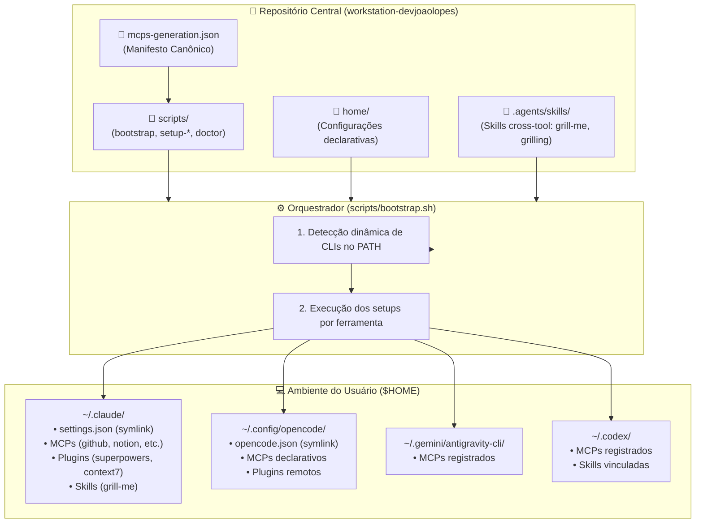

# Arquitetura de Orquestração — workstation-devjoaolopes (V0)

Este documento detalha o funcionamento interno, as decisões de design e o fluxo de dados da estação de trabalho de inteligência artificial `workstation-devjoaolopes`.

---

## 🎯 Filosofia de Design

Ambientes de desenvolvimento para engenharia de IA frequentemente utilizam múltiplos agentes e CLIs simultaneamente (**Claude Code**, **opencode**, **Antigravity CLI / agy**, **Codex CLI**). Cada ferramenta adota estruturas de arquivos e métodos de configuração proprietários em `$HOME`:

- `~/.claude/` (Claude Code: CLI `claude mcp`, `claude plugin` e `settings.json`)
- `~/.config/opencode/` (opencode: `opencode.json`)
- `~/.gemini/antigravity-cli/` (Antigravity CLI: `agy mcp`, `agy plugin` e `settings.json`)
- `~/.codex/` (Codex CLI: `codex mcp`, `codex plugin` e `settings.json`)

O objetivo desta arquitetura é fornecer **uma única fonte da verdade** versionada em Git, garantindo que qualquer máquina nova seja configurada de forma idêntica e automatizada com um único comando.

---

## 🏗️ Diagrama de Componentes e Fluxo

---

## 📜 1. O Manifesto Canônico (`mcps-generation.json`)

O arquivo `mcps-generation.json` na raiz é a fonte de verdade para humanos e agentes:

1. **`mcpServers`**: Lista de servidores MCP com seus transportes (`stdio` ou `http`), comando upstream, requisitos de autenticação e o comando CLI específico para cada ferramenta de IA suportada.
2. **`pluginsAndSkills`**: Plugins e frameworks (ex.: `superpowers`, `grill-me`), especificando o identificador do marketplace ou repositório Git upstream.

Qualquer alteração em ferramentas ou novos servidores adicionados deve iniciar obrigatoriamente pela atualização deste manifesto.

---

## 🔗 2. Estratégia de Symlinks Seguros (`link_file`)

As configurações declarativas localizadas na pasta `home/` e as skills em `.agents/skills/` são conectadas ao sistema através de symlinks simbólicos atômicos.

A função `link_file` (definida em `scripts/lib/common.sh`) implementa proteção contra perda acidental de configurações pré-existentes:

- Se o arquivo de destino já existir e for um arquivo comum (não um symlink), o instalador cria automaticamente um backup com extensão `.bak` antes de criar o link.
- Se o destino já for um symlink, ele é atualizado para o diretório atual do repositório (`ln -sfn`).
- A operação é **100% idempotente**, permitindo executar o `./scripts/bootstrap.sh` múltiplas vezes sem efeitos colaterais.

---

## 🔐 3. Gestão e Isolamento de Segredos

A segurança de credenciais adota uma política de zero vazamentos:

1. **`.env` local**: Variáveis sensíveis locais ficam em `.env` (ignorado no Git).
2. **Interpolação de Ambiente**: Arquivos como `opencode.json` utilizam `{env:VARIAVEL}`, garantindo que nenhum token estático seja salvo no arquivo versionado.
3. **GitHub CLI Fallback**: O helper `get_github_token` nos scripts verifica primeiro a variável `GITHUB_PERSONAL_ACCESS_TOKEN`. Se não estiver definida, obtém o token temporário da sessão ativa do GitHub CLI via `gh auth token`.
4. **OAuth em Chaveiro do SO**: Protocolos OAuth (como Notion) realizam o handshake diretamente no navegador e armazenam a sessão no keychain local de cada ferramenta.
